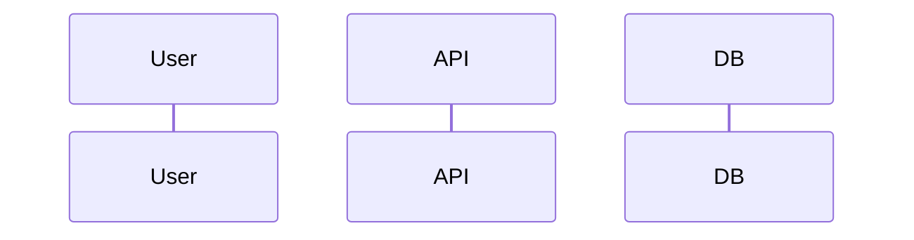

# 詳細設計書: <ユースケース名>

## 1. 概要

- **担当ユースケース / モジュール:** <basic-design §2.1 のどのモジュールか>
- **担当する要件 ID:** FR-xxx, FR-yyy
- **要件定義書:** `docs/features/<feature>/requirements.md`
- **基本設計書:** `docs/features/<feature>/basic-design.md`
- **対象バージョン:** v1

## 2. API 設計

### 2.1 エンドポイント一覧

| メソッド | パス | 概要 | 要件 ID | 必要ロール |
|----------|------|------|---------|-----------|
| GET | `/api/v1/...` | | FR-xxx | ROLE-001 |

### 2.2 エンドポイント詳細

#### `GET /api/v1/...`

- **概要:**
- **認証:** 要 / 不要
- **認可:** 必要ロール（要件の権限マトリクスに準拠）
- **リクエスト**

| パラメータ | 型 | 必須 | 説明 |
|-----------|-----|------|------|
| | | | |

- **レスポンス（200）**

```json
{
  "example": "..."
}
```

- **エラー:** §5 参照

<!-- エンドポイントごとに 2.2 を繰り返す -->

## 3. データベース設計

### 3.1 ER 概要
<!-- テーブル間の関係を文章または Mermaid で -->

### 3.2 テーブル定義

#### `table_name`

| カラム | 型 | NULL | デフォルト | 説明 |
|--------|-----|------|-----------|------|
| id | UUID | NO | | 主キー |

**インデックス**

| 名前 | カラム | 種別 |
|------|--------|------|
| | | |

**外部キー**

| カラム | 参照 | |
|--------|------|--|
| | | |

## 4. 画面詳細
<!-- Web UI がある場合。項目定義・バリデーション・API 対応 -->

| 画面 | 項目 | 型 | 必須 | バリデーション | 呼び出し API |
|------|------|-----|------|---------------|-------------|
| | | | | | |

## 5. エラーハンドリング

### 5.1 エラーコード一覧

| コード | HTTP | 説明 | 発生条件 |
|--------|------|------|----------|
| ERR_001 | 400 | | |
| ERR_403 | 403 | 権限不足 | ロール不一致 |

### 5.2 共通方針
<!-- ログレベル、クライアントへの露出情報など -->

## 6. シーケンス

### 6.1 <ユースケース名>
<!-- Mermaid sequenceDiagram 推奨 -->



## 7. 認可の実装方針
<!-- 基本設計の認証・認可を、エンドポイント・リソース単位で具体化 -->

| リソース / 操作 | チェック内容 | 要件 ID |
|----------------|-------------|---------|
| | | FR-xxx |

## 8. 要件トレーサビリティ

| 要件 ID | 詳細設計要素 |
|---------|-------------|
| FR-001 | API-xxx, table_yyy |

## 9. 未決事項

| ID | 内容 | 実装で解決 |
|----|------|-----------|
| | | はい / いいえ |

## 変更履歴

| 日付 | 変更内容 |
|------|----------|
| YYYY-MM-DD | 初版作成 |
