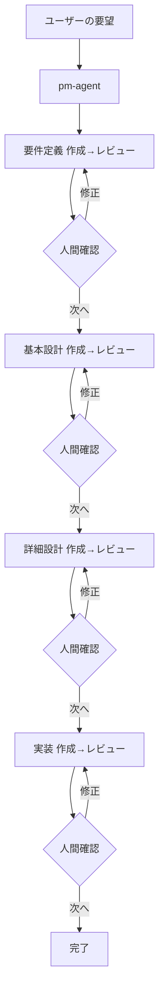

# spec-pipeline

一言の要望から、**要件定義 → 基本設計 → 詳細設計 → 実装**までを、作成とレビューを繰り返しながら段階的に進める、Cursor Agent Skills ベースの開発パイプライン。

各段階で自動レビューを行い、人間が成果物を確認してから次へ進む（ヒューマンゲート方式）。

## 全体フロー



- 作成とレビューは**自動で連続**実行する
- レビューで **Critical** があれば人間に渡す前に自動差し戻し（最大2回）
- 軽微な指摘は残したまま人間に提示し、人間が「次へ / 修正」を判断する

## ディレクトリ構成

```
.
├── .agents/                         # エージェント基盤（このリポジトリで管理）
│   ├── rules/                       # 全体ルール（常時 or ファイル別適用）
│   └── skills/
│       ├── orchestrators/pm-agent/  # パイプライン全体の指揮
│       ├── abilities/               # 各段階の作成・レビュー Skill
│       ├── workers/                 # 実装担当（frontend / backend / devops）
│       └── coaches/grill-me/        # 計画の壁打ち
└── projects/                        # 生成物（各プロジェクトが独自の git 管理／このリポジトリでは追跡しない）
    └── <project>/
        ├── docs/
        │   ├── architecture/        # 技術スタック・システム境界（横断）
        │   └── features/<feature>/
        │       ├── requirements.md
        │       ├── basic-design.md
        │       ├── detailed-design/ # ユースケース単位で複数可
        │       └── reviews/
        └── src/{frontend,backend,infra}
```

## Skill 一覧

### Orchestrator

| Skill | 役割 |
|-------|------|
| `pm-agent` | 要望受付・プロジェクト作成・段階進行・ヒューマンゲート・コミット |

### Abilities（段階ごとの作成 / レビュー）

| 段階 | 作成 | レビュー |
|------|------|----------|
| 要件定義 | `create-requirement_definition` | `review-requirement_definition` |
| 基本設計 | `create-basic_design` | `review-basic_design` |
| 詳細設計 | `create-detailed_design` | `review-detailed_design` |
| 実装 | `implement-from-design` | `review-code` |

### Workers / Coaches

| Skill | 役割 |
|-------|------|
| `frontend-worker` | `src/frontend/` の実装 |
| `backend-worker` | `src/backend/` の実装 |
| `devops-worker` | `src/infra/` の実装 |
| `grill-me` | 計画・設計の壁打ち（パイプライン外） |

## ルール

| ルール | 適用 | 内容 |
|--------|------|------|
| `tech-preferences` | 常時 | Python 優先・uv で依存管理 |
| `python-standards` | `*.py` | PEP 8 / 257 / 484・uv |
| `typescript-standards` | `src/frontend/**` | TypeScript / React 規約 |
| `api-design` | `src/backend/**` | REST 命名・バージョニング |
| `error-handling` | 常時 | エラー統一方針 |
| `testing-standards` | 常時 | カバレッジ・テスト配置・認可テスト必須 |
| `security-secrets` | 常時 | シークレット管理 |
| `commit-conventions` | 常時 | Conventional Commits |
| `documentation-language` | 常時 | 文書=日本語 / コード=英語 |

## 使い方

Cursor の Agent に対して、作りたいものを一言で伝える。

```
在庫管理システムを作りたい
```

`pm-agent` が起動し、プロジェクト名の確認 → フォルダ作成 → `git init` → 要件定義から順にパイプラインを進める。各段階で成果物とレビュー結果が提示されるので、「次へ」または「修正: ○○」で応答する。

## git 管理の方針

| リポジトリ | 管理対象 |
|-----------|----------|
| このリポジトリ（`spec-pipeline`） | `.agents/` のスキル・ルール |
| `projects/<project>/` | 各プロジェクトの成果物（独立した git リポジトリ） |

`projects/` は `.gitignore` で除外しており、プロジェクトごとに独立して履歴管理する。
